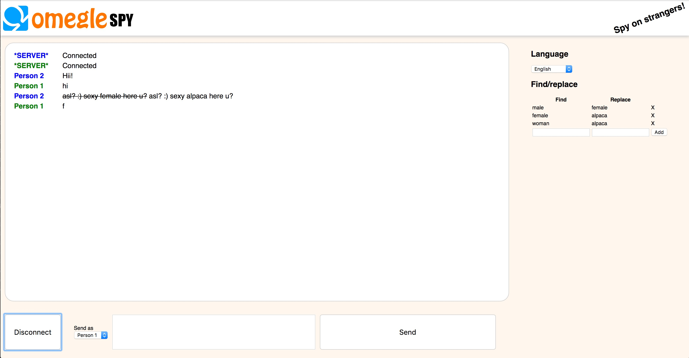

# Omegle Spy

Download [here](https://chrome.google.com/webstore/detail/omegle-spy/kikfhkfljahejemjadnfapnjifdpgbfi).

This is a Chrome extension that let's you spy on Omegle chatters. 

This serves mainly as a proof-of-concept to demonstrate how easy it is to do a `man-in-the-middle attack` on *anonymous* chat sites. But you can also do some fun stuff with it.

## Download

Download in the [Chrome Webstore](https://chrome.google.com/webstore/detail/omegle-spy/kikfhkfljahejemjadnfapnjifdpgbfi)

## DIY

`npm install` or `yarn` installs everything.

`npm start` starts a webserver at port 3000. Make sure you run Chrome with these flags `--disable-web-security --user-data-dir` (otherwise you get a CORS-error)

`npm run build` creates a build in `build`. You can load this build through the Chrome extension settings.

## Features 

- Multiple languages
- Find/replace strings (supports Regex)

## How does this work?

This extension created two connections to Omegle.

- You <-> Person 1 (A)
- You <-> Person 2 (B)

It then routes messages sent to one another:

- Person 1 <-> You <-> Person 2

You act as a man-in-the-middle, hence the name `man-in-the-middle-attack`.

## Banned?

Should you get banned, visit omegle.com and solve the captcha.